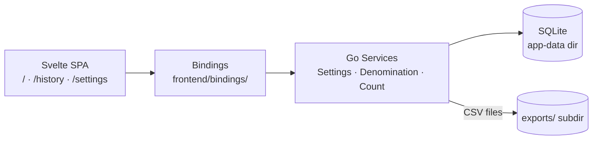
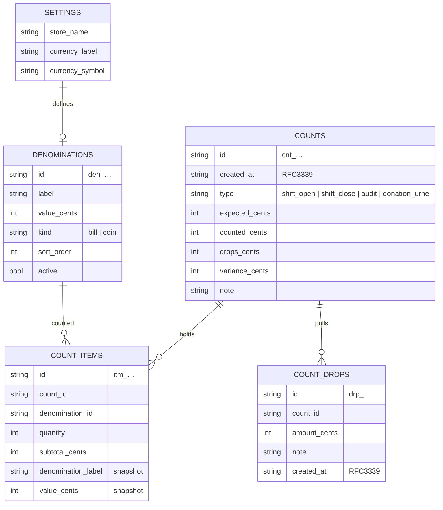
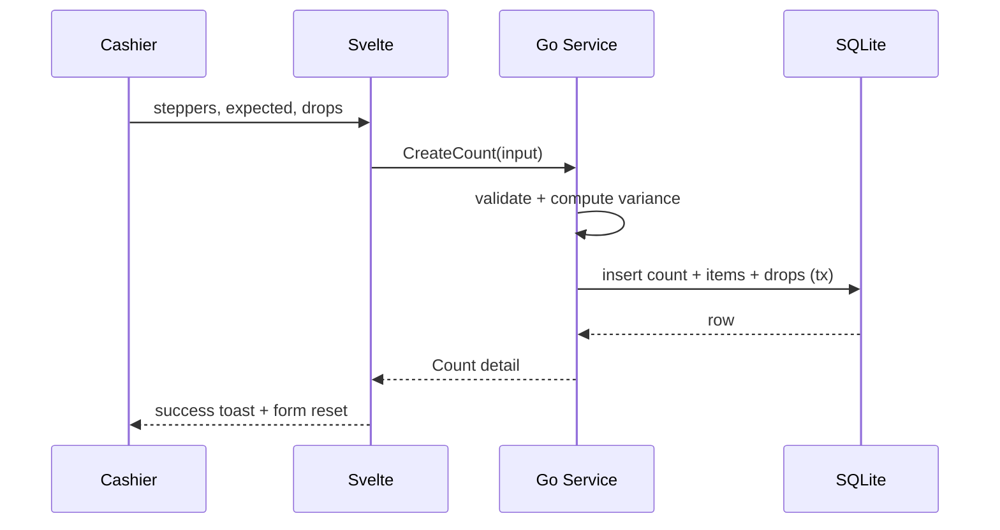

# Cash Count

Desktop app for POS **cash counting**: count the drawer by denomination, compare
against an expected amount, record safe drops, and keep a clean, exportable
history. Local-first, single register, Wails v3 + Svelte 5 (Vite SPA).

## Features

- [x] Denomination count grid with quantity steppers and live subtotals
- [x] Manual expected-amount entry (donation urns skip expected)
- [x] Variance (over/short) with color-coded feedback
- [x] Safe drops recorded against a count
- [x] Full count history with detail view, filters, and delete + undo
- [x] CSV export (single count + full history) into `exports/`
- [x] Configurable currency and denominations (EUR/USD/GBP presets)
- [x] English + French UI, dark/light mode

## Tech stack

| Layer     | Technology                                          |
| --------- | --------------------------------------------------- |
| Runtime   | Wails v3 (Go backend, WebView frontend)             |
| Backend   | Go services + SQLite (`modernc.org/sqlite`, no CGO) |
| Frontend  | Svelte 5 SPA (Vite + `svelte-spa-router`, hash routing) |
| UI        | Tailwind 4 + [shadcn-svelte](https://shadcn-svelte.com) |
| Bindings  | `wails3 generate bindings` (auto-generated JS)      |

## Quick start

Prereqs: Go, Node + `npm`, and the [Wails v3 CLI](https://v3.wails.io).

```bash
git clone <repo-url> cash-count-app && cd cash-count-app

cd frontend && npm install && cd ..

wails3 dev
```

The Vite build output is embedded into the Go binary, so the shipped app is
a single executable. A migration run seeds the database on first launch.

## Usage

**Open / close / audit a count** — Go to `Count`. Stepper `+`/`−` per
denomination, select the count type (`shift_open`, `shift_close`, `audit`,
or `donation_urne` — urns carry no expected amount), enter the expected
amount, add any safe drops, then **Save**. The variance panel updates live:

```
variance = counted + safe drops − expected
```

Zero = balanced · positive = over · negative = short.

**Record a safe drop** — In the Count panel, add an amount and optional note.
Drops factor back into the variance, so money pulled to the safe doesn't look
like a shortage.

Saving shows a success toast (with a shortcut to the new detail view) and
resets the form for the next count.

**Review history** — `History` lists every count (date, type, counted, expected,
variance), filterable by type. Open a row for the full breakdown of
denominations and drops. Deleting a count offers an undo restore.

**Export** — From history or a count detail: download a CSV for that count or
the whole history. Files are written to the `exports/` folder inside the app
data directory; the app shows the saved path with a copy button.

**Configure** — `Settings` sets the store name, picks a currency preset, and
lets you add, remove, or disable denominations. Changes apply live to the count
screen.

## Architecture

Three Go services back the whole app. The webview calls them through
auto-generated, type-safe bindings — no HTTP layer in between.



### Schema



IDs are opaque text (`NewID` with a type prefix). Item rows carry
denomination label/value snapshots, so history stays accurate even if
denominations are edited later.

Money is stored as **integer cents** throughout. Totals are denormalized onto
`counts`, so history stays accurate even if denominations are edited later.

### Data flow



## Storage

- Database: single SQLite file at the app-data directory root (e.g.
  `~/.local/share/cashcount/cashcount.db` on Linux).
- Exports: CSV files in the `exports/` subfolder (e.g.
  `~/.local/share/cashcount/exports/`). Older installs may still have loose
  `*.csv` files at the root; they are left untouched.
- Best backup: the app-data folder while the app is closed.

## Development

| Task                | Command                                  |
| ------------------- | ---------------------------------------- |
| Run (hot reload)    | `wails3 dev`                             |
| Regenerate bindings | `wails3 generate bindings`               |
| Backend checks      | `go vet ./...` and `go test ./...`         |
| Frontend checks     | `cd frontend && npm run check`             |
| Production build    | `wails3 build`                           |

Bindings are generated automatically on `dev`/`build` — never edit
`frontend/bindings/` by hand.

## Roadmap

- PDF export (HTML report printed from the webview, or a Go PDF lib).
- Expected cash computed from recorded POS sales.
- Multi-register support and cashier attribution.
- Per-count currency snapshot/remapping.
